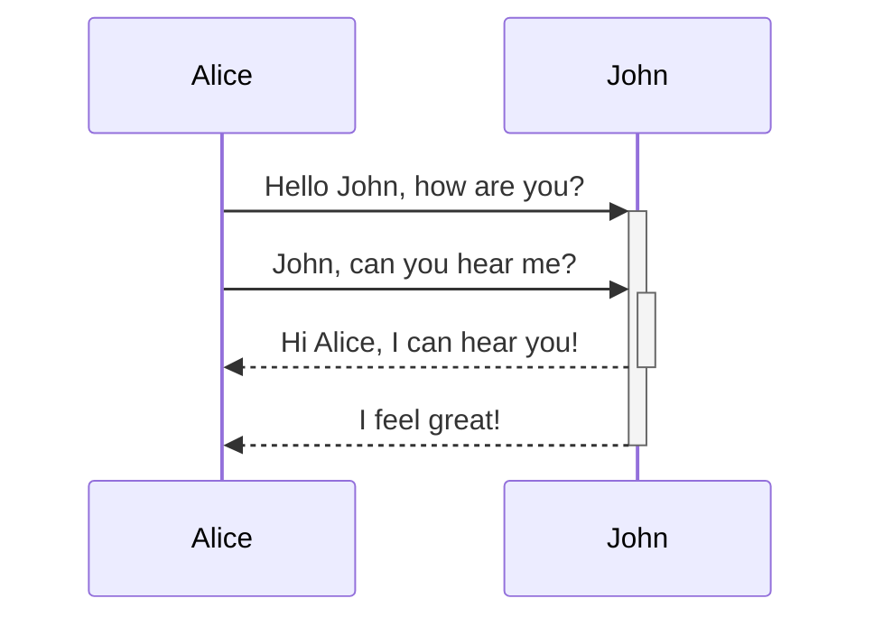
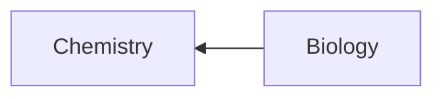

--- in line 1
- - 
+ + 
* * 
1. 1. 
2. 2. 
	1. 1. 

- [ ] - [ ] 
- [x] test

*italic*
**bold**
***bold-italic***


[[خلاصه زمین‌شناسی، نجوم]]
#tag


# h1
## h2
### h3
#### h4
##### h5
###### h6


---

```python
print("Hello")
```
---
```html
<h1 style="text-align: center;">Hello</h1>
```

> نقل قول

$latex-code$




| First name | Last name |
| ---------- | --------- |
| Max        | Planck    |
| Marie      | Curie     |



| Style                  | Syntax                 | Example                                  | Output                                 |
| ---------------------- | ---------------------- | ---------------------------------------- | -------------------------------------- |
| Bold                   | `** **` or `__ __`     | `**Bold text**`                          | **Bold text**                          |
| Italic                 | `* *` or `_ _`         | `*Italic text*`                          | _Italic text_                          |
| Strikethrough          | `~~ ~~`                | `~~Striked out text~~`                   | ~~Striked out text~~                   |
| Highlight              | `== ==`                | `==Highlighted text==`                   | ==Highlighted text==                   |
| Bold and nested italic | `** **` and `_ _`      | `**Bold text and _nested italic_ text**` | **Bold text and _nested italic_ text** |
| Bold and italic        | `*** ***` or `___ ___` | `***Bold and italic text***`             | **_Bold and italic text_**             |

\*\*This line will not be bold\*\*
\**This line will be italic and show the asterisks*\*

- [x] Milk
- [?] Eggs
- [-] Eggs

> [!tip] Callouts can have custom titles
> Like this one.

> [!faq]- Are callouts foldable?
> Yes! In a foldable callout, the contents are hidden when the callout is collapsed.

> [!question] Can callouts be nested?
> > [!todo] Yes!, they can.
> > > [!example]  You can even use multiple layers of nesting.

> [!note]
> Lorem ipsum dolor sit amet

> [!abstract]
> Lorem ipsum dolor sit amet

> [!info]
> Lorem ipsum dolor sit amet

> [!todo]
> Lorem ipsum dolor sit amet

> [!tip]
> Lorem ipsum dolor sit amet

> [!success]
> Lorem ipsum dolor sit amet

> [!question]
> Lorem ipsum dolor sit amet

> [!warning]
> Lorem ipsum dolor sit amet

> [!failure]
> Lorem ipsum dolor sit amet

> [!danger]
> Lorem ipsum dolor sit amet

> [!bug]
> Lorem ipsum dolor sit amet

> [!example]
> Lorem ipsum dolor sit amet

> [!quote]
> Lorem ipsum dolor sit amet

<iframe src="https://a67.ir"></iframe>

![[Excerpt from Mother of All Demos (1968).ogg]]

![[Document.pdf#page=3]]

![[Document.pdf#height=400]]

```query
lorem OR Example
```


```chartsview
#-----------------#
#- chart type    -#
#-----------------#
type: Line

#-----------------#
#- chart data    -#
#-----------------#
data:
  - label: "1"
    value: 0
  - label: "2"
    value: 1
  - label: "3"
    value: 4
  - label: "4"
    value: 9
  - label: "5"
    value: 16
  - label: "6"
    value: 25
  - label: " 7"
    value: 36
  - label: " 8"
    value: 49
  - label: " 9"
    value: 64
  - label: " 10"
    value: 81
  - label: " 11"
    value: 100
  - label: " 12"
    value: 121
  - label: " 13"
    value: 144

#-----------------#
#- chart options -#
#-----------------#
options:
  xField: label
  yField: value
```

✏
